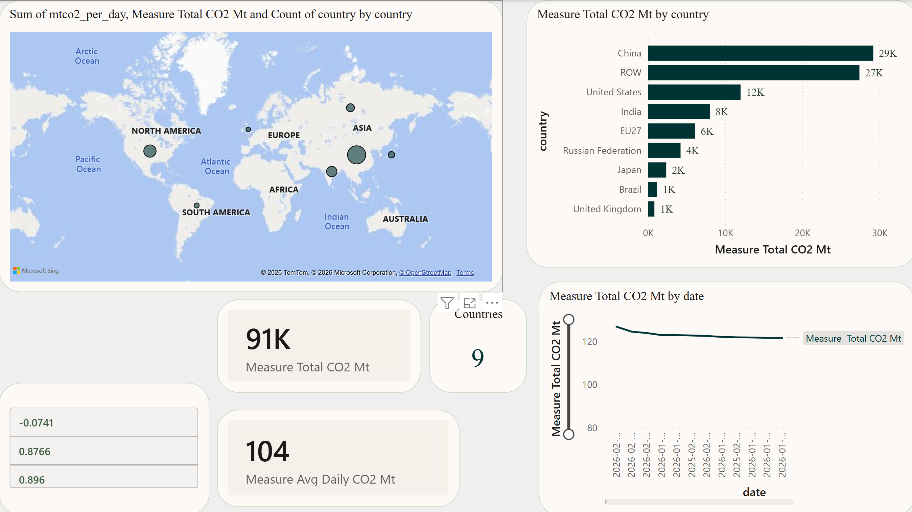
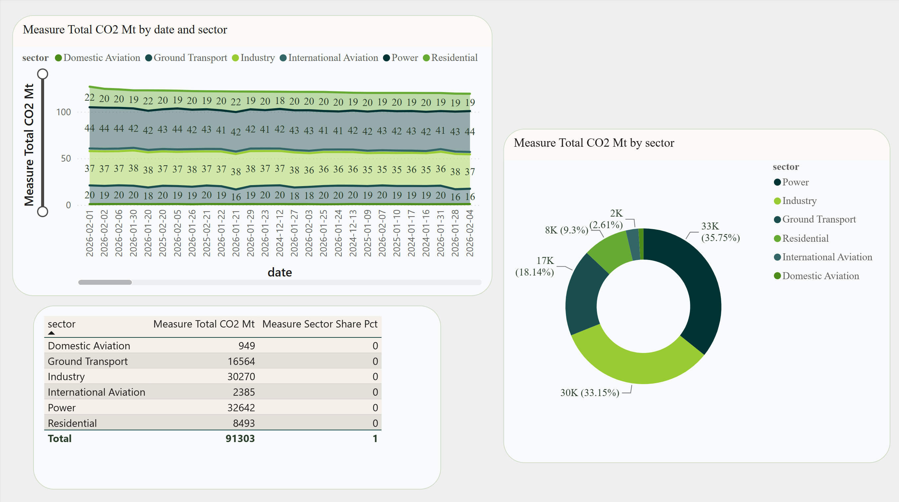

# 🌍 CO₂ Emission Forecasting for Climate Policy

> An end-to-end data science project that forecasts daily CO₂ emissions across 9
> world regions and evaluates which model best supports evidence-based climate
> policy — built on real [Carbon Monitor](https://carbonmonitor.org) data and
> replicating the benchmark of Ajala et al. (2025).


---

## 📌 Overview

Governments set climate targets using emission data that often arrives yearly and
late. This project asks a practical question: **which forecasting method should a
policy analyst actually use for near-real-time daily CO₂?**

It builds a complete, reproducible pipeline — raw data → SQL Server → machine
learning → dashboard → live web app — and benchmarks statistical against machine
learning models on daily Carbon Monitor data for **China, the United States,
India, EU27, Russia, Japan, Brazil, the United Kingdom, and the Rest of World**.

### Research questions

| # | Question | Finding |
|---|----------|---------|
| RQ1 | Can published results be replicated on public data? | **Yes** — Random Forest reached R² = 0.90, matching the ~0.92 benchmark |
| RQ2 | Which approach best supports policy decisions? | **Machine learning + SHAP** — accurate *and* explainable |
| RQ3 | What are the accuracy / interpretability / cost trade-offs? | ARIMA simplest but weakest; boosting accurate but heavier; **Random Forest is the sweet spot** |

---

## 📈 Key results

Forecasting **China's** daily emissions (Jan 2024 – May 2026) on a chronological
20% hold-out set:

| Model | R² | RMSE | MAE | MAPE |
|-------|-----|------|-----|------|
| ARIMA | −0.07 | 4.10 | 3.50 | 11.1% |
| **Random Forest** ⭐ | **0.896** | 1.28 | 1.00 | 3.1% |
| Gradient Boosting | 0.877 | 1.39 | 1.07 | 3.3% |

Both machine-learning models clearly beat the ARIMA baseline. **SHAP** analysis
shows the previous day's emissions (`lag_1`) overwhelmingly drive the forecast —
making the model both accurate and interpretable for short-term policy monitoring.

**Data insight:** across the 9 regions (~91,300 MtCO₂ total), China is the largest
emitter (~29,200 MtCO₂), followed by the Rest of World (~27,400). By sector,
**Power (36%) and Industry (33%)** together make up roughly **69%** of global
emissions — the sectors policy should target first.

---

## 📊 Power BI dashboard

An interactive 3-page dashboard built on the model outputs.

**Global overview** — world map, country ranking, and headline KPIs:



**Sector analysis** — sector shares over time and overall breakdown:



**Model performance** — accuracy comparison, forecast vs actual, and SHAP drivers:


---

## 🏗️ Architecture

```
Carbon Monitor Excel
        │  download.py  (clean & tidy)
        ▼
   SQL Server  ──►  analytical SQL  ──►  rankings & insights
 (PAM_CO2 DB)               │
        │  build_features.py│
        ▼                   ▼
   ARIMA (statsmodels)   RF / GB / XGBoost (scikit-learn)
        └──────────┬────────┘
                   ▼
      Evaluation: R² · RMSE · MAE · MAPE  +  SHAP
                   ▼
     Power BI dashboard   +   Streamlit web app
```

Every stage is a separate, testable Python module. `main.py` runs the whole
pipeline with a single command.

---

## 🧰 Tech stack

**Python** · **SQL Server** (T-SQL, SQLAlchemy, pyodbc) · **scikit-learn** ·
**statsmodels** · **XGBoost** · **SHAP** · **Power BI** · **Streamlit** ·
**Docker** · **GitHub Actions (CI)** · **pytest**

---

## 📁 Repository structure

```
co2-emission-forecasting/
├─ data/raw/            Carbon Monitor Excel (source data)
├─ sql/                 schema.sql · analysis_queries.sql · comparison_queries.sql
├─ src/
│   ├─ data/            download.py · etl.py · db.py · queries.py
│   ├─ features/        build_features.py
│   ├─ models/          arima_model.py · ml_models.py · evaluate.py
│   ├─ reporting/       powerbi_export.py  (+ SHAP)
│   └─ visualization/   plots.py
├─ app/                 streamlit_app.py   (interactive web app)
├─ powerbi/             dashboard, CSVs & build guide
├─ tests/               test_pipeline.py
├─ main.py              runs the full pipeline
├─ Dockerfile           containerises the app
├─ .github/workflows/   ci.yml  (tests on every push)
└─ requirements.txt
```

---

## 🚀 Quick start

**Prerequisites:** SQL Server (e.g. `localhost\SQLEXPRESS01`), the
[ODBC Driver for SQL Server](https://learn.microsoft.com/sql/connect/odbc/download-odbc-driver-for-sql-server),
and Python 3.11+.

```bash
git clone https://github.com/dharmik-29/co2-emission-forecasting.git
cd co2-emission-forecasting
python -m venv .venv ; .venv\Scripts\activate
pip install -r requirements.txt

python main.py                          # full pipeline: SQL Server + models
python -m src.reporting.powerbi_export  # dashboard CSVs + SHAP
streamlit run app/streamlit_app.py      # interactive web app
```

`main.py` connects with Windows Authentication and **creates the `PAM_CO2`
database automatically** — no manual database setup. Change `TARGET_COUNTRY` in
`src/config.py` to model a different country.

---

## ✅ Project phases (complete)

- [x] Repository setup, data acquisition & exploratory analysis
- [x] SQL Server schema, ETL pipeline & analytical queries
- [x] ARIMA baseline with stationarity diagnostics
- [x] Random Forest, Gradient Boosting & XGBoost
- [x] Model comparison, SHAP interpretability & Power BI dashboard
- [x] Streamlit web app, Docker & CI
- [x] Documentation, write-up & live demo

---

## 📚 Reference

Ajala, M. A., et al. (2025). *Daily CO₂ emissions prediction: machine learning,
deep learning and statistical models.* Science and Technology for Energy
Transition. — *primary replication target.*

Data: [carbonmonitor.org](https://carbonmonitor.org)

---

## 👤 Author

**Dharmik Dave** — MSc E-Government, University of Koblenz

[](https://www.linkedin.com/in/dharmik-dave-29bb45170)
[](https://github.com/dharmik-29)
[](https://dharmik-dave.netlify.app/)

Licensed under the [MIT License](LICENSE).
